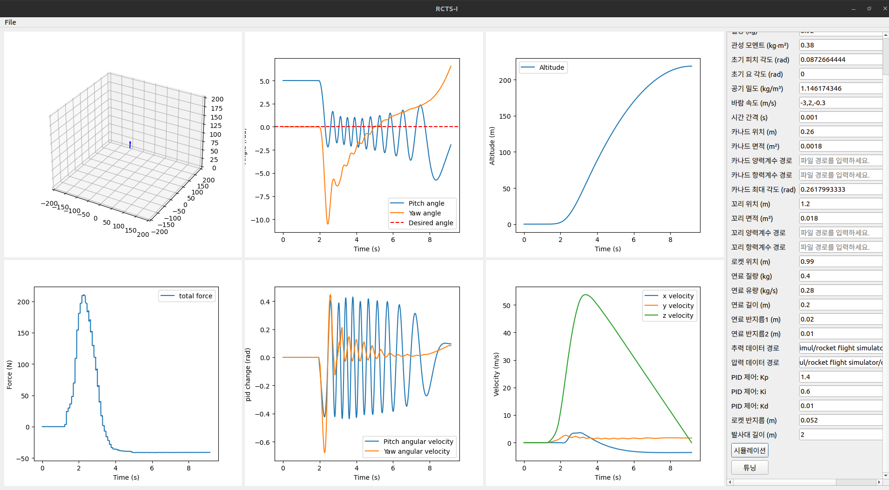

# rocket and missile flight simulation software to solve optimal pid coefficient with reinforcement learning model and Ziegler Nichols Method

this software simulate rocket's flight to design optimal rocket and solve optimal pid coefficient for canard fin control.

this simulation simulates rocket's rotationrotational movement and translational movement.

## feature
1. simulate rocket's flight
2. solve optimal pid coefficient for canard fin control with reinforcement learnging and Ziegler Nichols Method

## algoritm 
1. Changes in the rocket’s center of mass and moment of inertia due to fuel combustion

2. Relative velocity vector and aoa (angle of attack) of the fluid entering each canard fin, tail rotor, and body.

3. Calculate the lift and drag force received by each wing and body according to the relative velocity vector and aoa of the fluid.

4. Net force calculation that comprehensively calculates the thrust, gravity, lift, and drag of the rocket

5. Calculate the torque received by each part of the rocket

6. Calculate the rotational and translational motion of the rocket over time

7. Calculate the output value of the PID controller and canard pin state change according to the rocket’s attitude.

## required parameters 

<table style="border-collapse: collapse; width: 100.93%; height: 417px;" border="1" data-ke-align="alignLeft" data-ke-style="style5">
<tbody>
<tr style="height: 20px;">
<td style="width: 18.7861%; height: 20px;">번호</td>
<td style="width: 231.792%; height: 20px;">매개변수</td>
</tr>
<tr style="height: 20px;">
<td style="width: 18.7861%; height: 20px;">1</td>
<td style="width: 231.792%; height: 20px;">질량 중심</td>
</tr>
<tr style="height: 20px;">
<td style="width: 18.7861%; height: 20px;">2</td>
<td style="width: 231.792%; height: 20px;">압력 중심</td>
</tr>
<tr style="height: 20px;">
<td style="width: 18.7861%; height: 20px;">3</td>
<td style="width: 231.792%; height: 20px;">질량</td>
</tr>
<tr style="height: 20px;">
<td style="width: 18.7861%; height: 20px;">4</td>
<td style="width: 231.792%; height: 20px;">관성 모멘트</td>
</tr>
<tr style="height: 20px;">
<td style="width: 18.7861%; height: 20px;">5</td>
<td style="width: 231.792%; height: 20px;">초기 피치, 요 각도</td>
</tr>
<tr style="height: 20px;">
<td style="width: 18.7861%; height: 20px;">6</td>
<td style="width: 231.792%; height: 20px;">공기 밀도</td>
</tr>
<tr style="height: 20px;">
<td style="width: 18.7861%; height: 20px;">7</td>
<td style="width: 231.792%; height: 20px;">바람 속도</td>
</tr>
<tr style="height: 20px;">
<td style="width: 18.7861%; height: 20px;">8</td>
<td style="width: 231.792%; height: 20px;">시간 간격</td>
</tr>
<tr style="height: 20px;">
<td style="width: 18.7861%; height: 20px;">9</td>
<td style="width: 231.792%; height: 20px;">카나드 위치, 면적</td>
</tr>
<tr style="height: 40px;">
<td style="width: 18.7861%; height: 40px;">10</td>
<td style="width: 231.792%; height: 40px;">카나드, 꼬리날개의 양력, 항력 계수 cfd 데이터</td>
</tr>
<tr style="height: 20px;">
<td style="width: 18.7861%; height: 20px;">11</td>
<td style="width: 231.792%; height: 20px;">카나드 최대 각도</td>
</tr>
<tr style="height: 20px;">
<td style="width: 18.7861%; height: 20px;">12</td>
<td style="width: 231.792%; height: 20px;">꼬리날개 위치, 면적</td>
</tr>
<tr style="height: 20px;">
<td style="width: 18.7861%; height: 20px;">13</td>
<td style="width: 231.792%; height: 20px;">로켓 길이</td>
</tr>
<tr style="height: 20px;">
<td style="width: 18.7861%; height: 20px;">14</td>
<td style="width: 231.792%; height: 20px;">연료 질량, 유량, 내경, 외경</td>
</tr>
<tr style="height: 20px;">
<td style="width: 18.7861%; height: 20px;">15</td>
<td style="width: 231.792%; height: 20px;">엔진 추력 데이터</td>
</tr>
<tr style="height: 20px;">
<td style="width: 18.7861%; height: 20px;">16</td>
<td style="width: 231.792%; height: 20px;">엔진 압력 데이터</td>
</tr>
<tr style="height: 17px;">
<td style="width: 18.7861%; height: 17px;">17</td>
<td style="width: 231.792%; height: 17px;">Kp, Ki, Kd</td>
</tr>
<tr style="height: 20px;">
<td style="width: 18.7861%; height: 20px;">18</td>
<td style="width: 231.792%; height: 20px;">로켓 외경</td>
</tr>
<tr style="height: 20px;">
<td style="width: 18.7861%; height: 20px;">19</td>
<td style="width: 231.792%; text-align: left; height: 20px;">발사대 길이</td>
</tr>
</tbody>
</table>

## software picture

